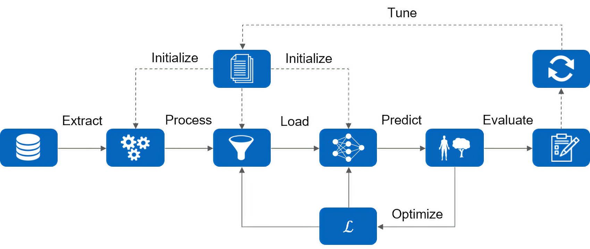

# RadarSeg
The radar segmentation (RadarSeg) project provides a complete pipeline to perform semantic segmentation on automotive radar data. The goal of this project is the provision of a flexible and modular development platform to enable an easy application of new model architectures. Two example figures show the network segmentation output using input data without radar velocity information on the left and with radar velocity information on the right.

<p align="middle">
 

</p>

The complete pipeline from data pre-processing to model evaluation is illustrated in the following and the tutorial will guide you through this repository.



## Preparation
To get started we first want to create a dedicated project folder which contains everything we need throughout this project. Within this folder create three additional folders like so:
* data - which contains the raw datasets,
* preprocessed - which contains the pre-processed datasets and
* log - to store the training logs.  

In a second step we would need to download the nuScenes dataset which is used for this project. To do so, just follow the instructions on the [nuScenes download page](https://www.nuscenes.org/download). Note that it is important to maintain the same folder structure as proposed within the [nuScenes setup guide](https://github.com/nutonomy/nuscenes-devkit#nuimages-setup). To keep it clean, create a nuscenes folder within the data directory and unpack everything within this folder.

To finish the preparation work just clone this repository by executing the following command within your project folder.
```
git clone https://github.com/TUMFTM/RadarSeg.git
```

<details>
<summary>Your folder structure should now look like this</summary>
<br>

```
.
|  
+---data/  
|   |  
|   +---nuscenes/  
|   |   |  
|   |   +---maps/  
|   |   |  
|   |   +---samples/  
|   |   |  
|   |   +---sweeps/  
|   |   |  
|   |   +---v1.0-trainval/  
|  
+---log/  
|  
+---preprocessed/  
|  
+---RadarSeg/  
|   |  
|   +---docs/  
|   |   |  
|   |   +---images/  
|   |  
|   +---examples/  
|   |  
|   +---radarseg/  
|   |   |  
|   |   +---config/  
|   |   |  
|   |   +---data/  
|   |   |  
|   |   +---model/  
|   |   |  
|   |   +---train/  
|   |   |  
|   |   +---visu/  
```

</details>
<br />

## Environment
Next, we want to setup of the development environment, which is as easy as the rest of the pipeline. To ensure the full functionality of all modules we suggest using the provided docker file. However if you prefer another development environment you can find all required version specifications in the environment specifications below and the mentioned [docker file](Dockerfile).  

To setup your development environment just execute the following commands from inside the repository folder. If you want to learn more about the used command line options, we suggest to have a look at the [docker command line reference](https://docs.docker.com/engine/reference/run/).

1. Ensure that you are inside the repository folder
    ```
    cd RadarSeg/
    ```

2. Build the docker image
    ```
    docker build --tag tf2-gpu-py3-radarseg:2.2.0 .
    ```

3. Run the docker container and mount all four directories. Adapt the `src` paths below to your local setup.
    ```
    docker run --name container -it -d --mount 'type=bind,src=/home/project/data,dst=/data' --mount 'type=bind,src=/home/project/log,dst=/log' --mount 'type=bind,src=/home/project/preprocessed,dst=/preprocessed' --mount 'type=bind,src=/home/project/RadarSeg,dst=/radarseg' --gpus all --cap-add=CAP_SYS_ADMIN tf2-gpu-py3-radarseg:2.2.0 bash
    ```

4. Attach to the running container and install the project
    ```
    docker attach container
    ```
    ```
    cd radarseg/
    ```
    ```
    pip install -e .
    ```
<details>
<summary>Environment Specifications</summary>
<br>

| Object          | Version         |
| --------------- |----------------:|
| OS              |   Ubuntu 18.04.3|
| Kernel          | 5.3.0-53-generic|
| CUDA            |       10.1.243-1|
| cuDNN           |       7.6.4.38-1|
| NVIDIA Driver   |           440.59|
| Python          |            3.6.9|
| TensorFlow      |            2.2.0|
| gcc             |            7.5.0|

</details>
<br />

## Configuration
Next up is the configuration of your overall pipeline, which is done by a dedicated configuration file. The configuration file defines all hyper parameters of the dataset creation, the model architecture, and the training process itself. The configuration file can be created by yourself or just by modifying one of the existing configuration files in the [examples](examples) folder (which is recommended if you are new to the project). If you are more interested in how to write your own configuration file have a look at the [config](radarseg/config/README.md) module.

## Pre-Processing
If your configuration is ready, the next step is the creation of a dataset. A dataset is easily created by just executing the preprocess script form inside the project folder in your docker container (or your environment of choice). *Hint: Currently the nuScenes dataset is the only supported dataset.*
* `--config <path to the config file>` 
* `--data <path to the raw dataset>`
* `--out <path to store the pre-processed dataset>`  

Example usage:
```
python3 radarseg/preprocess.py --config 'examples/02_KPConvCLSTM.ini' --data '/data/nuscenes' --out '/preprocessed/dataset'
```

A pre-processed data set which distinguisheds between the classes `vehicle.moving` and `background` can be downloaded [here](https://syncandshare.lrz.de/getlink/fiYcFgY9xqcypADWbc2Sh5zx/preprocessed_moving_trainval.tar.xz). The pre-processed data set can be used to directly start a training. The data should be extracted on the disk to the location that the docker folder `/preprocessed/dataset` points to. 

## Training
Once you have created your pre-processed dataset you are ready to start your model training. To start a model training is as simple as creating a dataset by just executing the train script.
* `--config <path to the config file>` 
* `--data <path to the pre-processed dataset>`
* `--logs <path to store the training logs>`  

Example usage:
```
python3 radarseg/train.py --config 'examples/02_KPConvCLSTM.ini' --data '/preprocessed/dataset'
```

Trained checkpoints for the KPConvCLSTM and KPLSTM networks with the example data set configuration are available in the repository. They can be used to skip training and directly perform an evaluation on the nuscenes data set.

## Observation
From the moment your model is running, you can observe the training progress by monitoring your configured callbacks. This observation is done within a TensorBoard application that can be started as following.

1. Run a TensorBoard docker container
    ```
    docker run --name tensorboard -it -d --mount 'type=bind,src=/home/project/log,dst=/log' --gpus all -p 6006:6006 tf2-gpu-py3-radarseg:2.2.0 bash
    ```

2. Attach to the tensorboard container
    ```
    docker attach tensorboard
    ```

3. Run the TensorBoard application
    ```
    tensorboard --logdir '/log/' --host 0.0.0.0
    ```

4. View TensorBoard in your Crome browser
    ```
    http://localhost:6006/
    ```

## Evaluation
If you would like to further evaluate the model training and visualize the model predictions, you can run a model evaluation on your created model. Therefore, just run the evaluation file within the docker container similar to the model training.  
* `--config <path to the config file>` 
* `--dataroot <path to the raw dataset>`
* `--data <path to the pre-processed dataset>`
* `--logs <path to store the evaluation logs>`
* `--checkpoint <path to the model checkpoint>`  

Example usage:
```
python3 radarseg/evaluate.py --config '/radarseg/examples/02_KPConvCLSTM.ini' --dataroot '/data/nuscenes' --data '/preprocessed/dataset' --logs '/log/example_KPConv-CLSTM' --checkpoint '/radarseg/examples/KPConvCLSTM/checkpoint'
```

## Folder structure
* [config](radarseg/config) contains tools to handle and validate the pipeline configuration files.
* [data](radarseg/data) contains the dataset generator and dataset specific utility functions.
* [model](radarseg/model) contains all keras models and model layers as well as the model builder to compile the model.
* [train](radarseg/train) contains the training utility function such as callbacks, loss functions and evaluation metrics.
* [visu](radarseg/visu) contains visualization tools to render model results.

## Files
* [preprocess.py](radarseg/preprocess.py): Data pre-processor to create a consumable dataset.
* [train.py](radarseg/train.py): Model trainer to train a configured model on the dataset.
* [evaluate.py](radarseg/evaluate.py): Model evaluator to evaluate a trained model.
* [gitlab-ci.yml](.gitlab-ci.yml): Definition of the continuous integration pipeline.
* [Dockerfile](Dockerfile): Definition of the docker image to provide the project environment.
* [setup.py](setup.py): Setup file to install to radarseg project.

## Contributions
[1] F. Fent, "Machine Learning-Based Radar Point Cloud Segmentation," Master's Thesis, Technical University of Munich, 2020.

If you find our work useful in your research, please consider citing:

    @INPROCEEDINGS{nobis21radar,
        author={Nobis, Felix and Fent, Felix and Betz, Johannes and Lienkamp, Markus},
        title={Kernel Point Convolution LSTM Networks for Radar Point Cloud Segmentation - The Necessity for Quality Public Radar Data},
        booktitle={MDPI Applied Sciences},
        year={2021},
    }